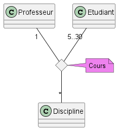

# Diagramme de classe

## Vrai ou faux

Etant donné le diagramme de domaine ci-dessus, les assertions suivantes sont-elles vraies ou fausses ? 
1. Etudiant est une classe d’association
2. Un étudiant peut participer à autant de cours qu’il veut
3. Plusieurs professeurs peuvent enseigner la même discipline
4. Un professeur peut enseigner plusieurs disciplines
5. Un cours peut être enseigner à 2 étudiants
6. Un cours peut être enseigner à 20 étudiants 

Réponses:
1. faux -> étudiant class conceptuelle
2. Vrai -> on regarde la cardinalité vers cours
3. Faux -> la cardinalité de professeur est 1
4. Vrai -> la cardinalité de discipline est * 
5. Faux -> la cardinalité est  5 à 30 donc pas possible
6. Vrai -> cardinalité de 5 à 30 donc possible
## Question ouverte

Représentez la même association avec la notation UML « petit losange » 

- Quelles informations perd-on par rapport au diagramme ci-dessus ? 
On perd la cardinalité ( * ) de la classe Cours et le nom de l'association.  
 

